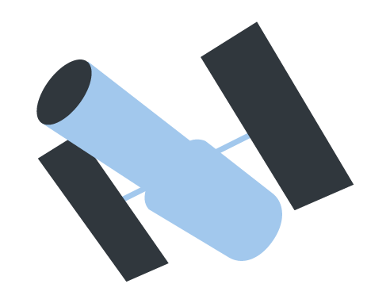

# Hubble

a javascript lens library



## What Does That Mean?

This library makes it easy to inspect and manipulate data structures. In particular lenses excel at efficient immutable update.

That's a mouthful, but I think it's easiest to understand through examples.

```javascript
// data structure to manipulate
var recipe = {
    ingredients: [
        {
            name: "chocolate",
            quantity: "1 cup"
        }
    ],
    steps: [
        "unwrap chocolate",
        "eat chocolate"
    ]
};

// get part of the data structure. in this case we're getting the name of the
zero-th element of ingredients.
lens(recipe).get(["ingredients", 0, "name"])
// returns "chocolate"

// we can also get a modified version of the data structure
// this doesn't modify the original
var newRecipe = lens(recipe)
    .set(["steps", 0], "unwrap chocolate, without eating all of it")
    .freeze();
// returns a structure that looks just like `recipe`, but with a different
// first step
```

Using immutable-js? There's support for that too.

```javascript
var immutableRecipe = Immutable.fromJS(recipe);

// our previous examples still work! get and set values with a simple
// interface. Modifications are batched.
lens(immutableRecipe).get(["ingredients", 0, "name"])

var newRecipe = lens(immutableRecipe)
    .set(["steps", 0], "unwrap chocolate, without eating all of it")
    .freeze();
```

##  Up and Running in One Easy Step

TODO

## Reference

TODO
